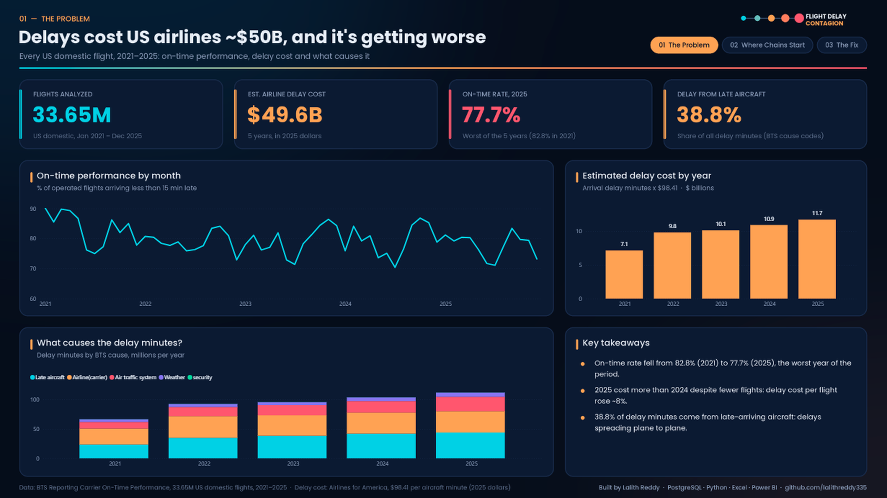
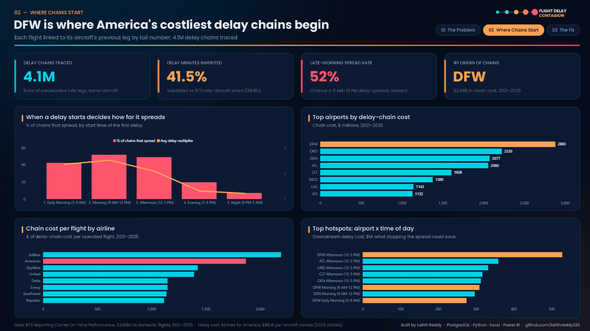
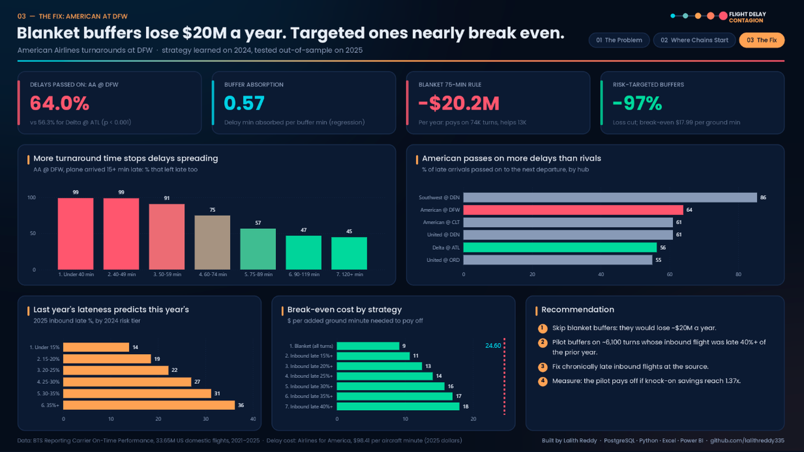

# ✈️ Flight Delay Contagion: How One Late Plane Ruins the Whole Day

**I traced 33.65M US flights (2021–2025) aircraft by aircraft to find where delay chains start, how far they spread, and whether schedule buffers pay for themselves. The obvious fix, blanket buffers, would lose American Airlines about $20M a year at DFW. A targeted version, learned on 2024 data and tested on 2025, cuts that loss by 97% and roughly breaks even. The recommendation is a measured pilot, not a rollout.**



**Tools:** PostgreSQL · SQL (window functions) · Python (pandas, scipy, statsmodels) · Excel · Power BI

📄 [Executive memo](docs/executive_memo.pdf) · 📊 [Presentation deck](docs/presentation_deck.pdf) · 📈 [Dashboard PDF](dashboard/flight_delay_contagion_dashboard.pdf) · 🧮 [Excel savings model](excel/buffer_savings_model.xlsx)

---

## Business problem

Every minute an aircraft is delayed costs US airlines about **$98.41** in crew, fuel and maintenance ([Airlines for America, 2025](https://www.airlines.org/dataset/u-s-passenger-carrier-delay-costs/)). The biggest hidden driver is **delay propagation**: when one aircraft runs late, every later flight in its rotation inherits the delay.

Most delay analyses stop at "which airline is worst." This one follows each plane through its day using tail numbers, to answer the question an airline VP of Operations actually has: **where would a fix break the chain at the lowest cost?**

**Stakeholder:** VP of Operations, American Airlines

## Key findings

| # | Finding | Evidence |
|---|---|---|
| 1 | **Delays cost ~$50B over five years, and it's getting worse.** | Estimated delay cost rose from $7.1B (2021) to $11.7B (2025); on-time rate fell from 82.8% to 77.7%. |
| 2 | **41.5% of chain delay minutes are inherited from an earlier flight.** | 4.1M delay chains traced; independently matches BTS's own late-aircraft share (38.8%). |
| 3 | **Late-morning delays spread most.** | A 9 AM–noon delay spreads to the next flight 51.7% of the time, vs 7.1% at night. |
| 4 | **DFW is the #1 source of costly chains, and American runs tighter turns than rivals.** | DFW: $2.88B in chain cost. American passes on 64.0% of late arrivals at DFW vs Delta's 56.3% at ATL (z = 36.8, p < 0.001). |
| 5 | **Turnaround time absorbs delay.** | Each extra buffer minute absorbs 0.57 min of delay (regression, 95% CI 0.55–0.60). Turns under 60 min pass delays on 93.9% of the time vs 49.1% at 75+ min. |
| 6 | **Blanket buffers lose money; targeted ones nearly break even.** | Blanket 75-min rule: −$20.2M/yr. Buffering only turns whose inbound flight was late 40%+ the prior year: −$0.7M/yr (97% smaller loss). |

## Recommendation

1. **Skip blanket buffers.** A 75-minute rule on every DFW turn would lose about $20M a year.
2. **Pilot buffers on ~6,100 high-risk turns.** Target turns whose inbound flight was late 40%+ of the prior year (~105K buffer minutes a year).
3. **Fix chronically late inbound flights at the source.**
4. **Measure before scaling.** The pilot pays off if knock-on savings reach 1.37× direct savings; the chain analysis measured 1.31× (evening) to 2.08× (afternoon).

## Dashboard

| Where chains start | The fix |
|---|---|
|  |  |

Built in Power BI on 11 summary tables in PostgreSQL, with a custom dark theme and designed page backgrounds. [Open the .pbix](dashboard/flight_delay_contagion.pbix).

## How it works

```
BTS monthly CSVs (60 files) → Python download + load → PostgreSQL (33.65M rows)
  → SQL: clean analytics table → delay-chain tracing → hotspots → turnaround analysis
  → Python: chi-square, regression, z-test
  → Excel: buffer savings scenario model
  → Power BI dashboard + memo + deck
```

**The core technique:** `LAG()` over `PARTITION BY tail_number ORDER BY sched_dep_ts` links every flight to its aircraft's previous leg. A late flight whose previous leg was also late (same aircraft, landed at this airport, turnaround 0–6 hours) *inherited* its delay; otherwise it *started* a new chain. See [`sql/04_delay_chains.sql`](sql/04_delay_chains.sql).

| Step | File |
|---|---|
| Download BTS data | [`scripts/download_bts.py`](scripts/download_bts.py) |
| Load into PostgreSQL | [`scripts/load_to_postgres.py`](scripts/load_to_postgres.py), [`sql/01_create_tables.sql`](sql/01_create_tables.sql) |
| Indexes and validation | [`sql/02_indexes_and_checks.sql`](sql/02_indexes_and_checks.sql) |
| Clean analytics table | [`sql/03_build_analytics_table.sql`](sql/03_build_analytics_table.sql) |
| Delay-chain tracing | [`sql/04_delay_chains.sql`](sql/04_delay_chains.sql) |
| Airports, airlines, hotspots | [`sql/05_chain_hotspots.sql`](sql/05_chain_hotspots.sql) |
| Turnaround analysis | [`sql/06_turnaround_analysis.sql`](sql/06_turnaround_analysis.sql) |
| Excel model inputs | [`sql/07_excel_model_inputs.sql`](sql/07_excel_model_inputs.sql) |
| Risk-based buffer test | [`sql/08_risk_based_buffers.sql`](sql/08_risk_based_buffers.sql) |
| Dashboard tables | [`sql/09_dashboard_tables.sql`](sql/09_dashboard_tables.sql) |
| Statistical tests | [`scripts/stats_tests.py`](scripts/stats_tests.py) → [`docs/stats_results.md`](docs/stats_results.md) |
| Full findings log | [`docs/findings_log.md`](docs/findings_log.md) |

## Validation and data quality

- **Row counts reconciled:** 33,653,101 rows downloaded = 33,653,101 loaded, across all 60 months. One file (Aug 2024) failed at first because a null flight number turned the column into decimals; caught through the row-count gap and fixed.
- **Only 0.29% of rows lack a tail number,** so chain tracing covers 99.7% of flights.
- **Two independent checks agree:** chain logic says 41.5% of delay minutes are inherited; BTS cause codes say 38.8%. The SQL and Excel savings figures match exactly.
- **No hindsight:** high-risk turns are picked with 2024 data and scored on 2025.
- **Honest corrections:** the raw turnaround comparison suggested ~0.85 min absorbed per buffer minute; controlling for incoming delay gave the conservative 0.57 used in the model. The initial hypothesis (early-morning delays spread most) was wrong; late morning does.

## Assumptions and limitations

- Delay cost = arrival delay minutes × $98.41 (A4A 2025 average cost of aircraft block time), in 2025 dollars. Direct airline cost only; excludes passenger time.
- Cost of an added ground minute is assumed at 25% of block cost ($24.60). The Excel model's sensitivity tab shows results from $5 to $50 per minute.
- Buffers are applied to historical schedules; real schedule changes could shift aircraft rotations and utilization.

## Reproduce it

1. Install PostgreSQL and create a database named `flights`.
2. `pip install pandas requests psycopg2-binary scipy statsmodels`
3. `python scripts/download_bts.py` (about 30–60 min; raw data is not committed)
4. Run `sql/01_create_tables.sql`, then `python scripts/load_to_postgres.py`
5. Run the SQL files `02` to `09` in order, then `python scripts/stats_tests.py`

## Data sources

- Bureau of Transportation Statistics, [Reporting Carrier On-Time Performance](https://www.transtats.bts.gov/), Jan 2021–Dec 2025
- Airlines for America, [U.S. Passenger Carrier Delay Costs](https://www.airlines.org/dataset/u-s-passenger-carrier-delay-costs/)
